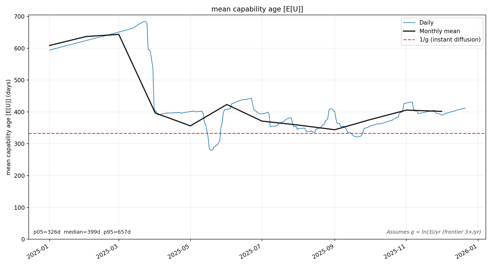

# Digitizing time series from the PDF (Figures 5/6/11/15)

This repo contains scripts to digitize several plots from `w34608.pdf` into calibrated time series (and to verify the digitization against the original embedded raster plot).

Important: in this PDF the plots are embedded as raster images (not vector strokes), so the workflow is:
1) extract the embedded image stream from the PDF,
2) find the plot rectangle inside that raster,
3) segment the marks of interest (red curve, black frontier, gray percentile bands),
4) calibrate pixels → data units (dates + y values),
5) export a time series.

## Install (uv)

```bash
uv venv
source .venv/bin/activate
uv pip install pymupdf opencv-python-headless numpy matplotlib pandas scipy
```

Dependencies are also listed in `pyproject.toml`.

## Quick start

Figure 15 red median (token-weighted intelligence median):

```bash
source .venv/bin/activate
python extract_figure15_red_timeseries.py --figure 15 --pdf w34608.pdf --outdir out
python verify_figure15_percentiles.py --pdf w34608.pdf --outdir out
```

Figure 11 percentiles (price-to-intelligence ratio, log y-axis):

```bash
source .venv/bin/activate
python extract_figure15_red_timeseries.py --figure 11 --pdf w34608.pdf --outdir out --percentiles
python verify_figure11_percentiles.py --pdf w34608.pdf --outdir out
```

Note: Figure 11’s pre-2024 region is not reliably extractable from the embedded raster; the script
therefore hard-cuts the exported Figure 11 percentile time series to start at `2024-01-01` (01/24).

Run regression/sanity checks (keeps Figure 15 behavior from breaking as Figure 11 logic evolves):

```bash
source .venv/bin/activate
python smoke_test.py
```

## How the extraction works (high level)

### 1) Extract the embedded raster from the PDF
We use `pymupdf` to locate the figure image object on the correct page and extract the embedded bitmap.

### 2) Find the plot rectangle
We detect the plotting area (excluding titles/legends/margins) using a mixture of heuristic edge detection + gridline density + whitespace structure.

### 3) Calibrate axes
- **x-axis (date)**: inferred from the plot’s known date span and the detected plot rectangle width; the scripts use the printed ticks/gridlines to sanity-check alignment.
- **y-axis (linear)**: inferred from axis bounds and plot rectangle height.
- **y-axis (log)** (Figure 11): we additionally OCR-like detect the left-side tick label glyphs (the “0.1 / 1 / 10 / 100” strip), estimate their vertical centers, and fit `log10(value) = m*y + c` for pixel→value mapping.

### 4) Segment marks
- **Red median curve**: thresholding in HSV/HSV-like space to isolate “red”; then per-column pick a representative y pixel and smooth.
- **Black frontier curve** (Figure 6): threshold near-black and trace a step function.
- **Gray percentile bands** (Figures 11/15): classify pixels into background / dark band / light band (and gridlines), then for each x-column compute band envelopes:
  - `p25–p75` from the dark band,
  - `p10–p90` from the union of (dark+light) bands.

### 5) Export time series
We map pixel envelopes into calibrated y-values at daily resolution and write CSVs, plus “reconstructed” plots for eyeballing.

## Verification (why the IoU plots exist)
Percentile-band extraction can be visually plausible but wrong, so the repo includes verification scripts:
- build an **observed** band mask directly from the original plot raster,
- build a **predicted** band mask by re-rendering the extracted envelopes back into pixel space,
- compare them with IoU + miss/extra diagnostics.

This produces the 4-panel “verification” images in `out/` (original crop, observed mask, predicted mask, and error map).

## Caveats and Limitations

1) **Embedded raster dependency / reproducibility**
All extraction operates on the bitmap image embedded in `w34608.pdf` (via PyMuPDF’s image extraction), not on vector strokes. Results are reproducible for the same PDF bytes; if the PDF is re-generated/re-rasterized (different DPI, compression, color profile, or anti-aliasing), the pixel thresholds and heuristics may need re-tuning.

2) **Gridlines vs fill & anti-aliasing**
The gray gridlines and semi-transparent gray fills can overlap in intensity, so gridlines may be misclassified as fill (or vice versa). Anti-aliased edges introduce ~1–3 px boundary uncertainty, which is why the code has explicit gridline masking + small envelope padding.

3) **Figure 11 pre-2024**
Figure 11’s percentile bands are not reliably separable before ~01/24 in the embedded raster. The script hard-cuts the exported Figure 11 percentile series to start at `2024-01-01`; earlier output should not be trusted.

4) **What IoU verification does and does NOT guarantee**
IoU measures pixel-mask overlap between (a) an “observed” fill mask extracted directly from the raster and (b) a “predicted” fill mask re-rendered from the extracted time series. High IoU means the reconstructed bands occupy approximately the same pixels; it does not prove perfect y-axis calibration, exact percentile values, or correctness in excluded regions (legends/labels).

## Outputs (typical)
- Figure 15
  - `out/figure15_token_weighted_percentiles.csv`
  - `out/figure15_percentiles_comparison.png`
  - `out/figure15_percentiles_verification.png`
- Figure 11
  - `out/figure11_price_to_intelligence_ratio_percentiles.csv`
  - `out/figure11_percentiles_comparison.png`
  - `out/figure11_percentiles_verification.png`

## Main Plot: Dollar-Weighted Mean Capability Age



This plot shows how "old" the token-weighted model market is over time (in capability terms).

```bash
python plot_dollar_weighted_mean_capability_age.py
```

### Methodology
1. Uses 4 intelligence bands from Figure 15: p10-p25 (15%), p25-p50 (25%), p50-p75 (25%), p75-p90 (15%)
2. Computes geometric-mean token price within each band (Figure 11 × Figure 15)
3. Inverts the frontier curve (Figure 6) to find when each intelligence level was first achieved
4. Computes dollar-weighted mean of capability ages across bands

### Key Assumptions
- **Frontier growth rate**: g = ln(3)/year (frontier improves 3× per year)
- **Instant diffusion baseline**: 1/g ≈ 332 days — theoretical E[U] if spending instantly shifted to frontier
- **Percentile alignment**: The method multiplies percentiles from two independent distributions (token→intelligence and price/intelligence ratio), assuming the k-th percentile in each distribution represents comparable market positions. This is an approximation—the p50 of intelligence isn't necessarily the same models as the p50 of price/intelligence.
- Only covers dates where Figure 11 and Figure 15 overlap (2024-01 onward)

## Scraping Setup (optional)

The `scraping/` directory replicates paper methodology using public APIs. Requires:
- `.env` file with `GCP_PROJECT=<your-project>` for cloud sync (not committed)

**Script categories:**
- Production: `extract_*.py`, `verify_*.py`, `smoke_test.py`, `scraping/run_daily.py`
- Experimental/analysis: `scraping/overlays/*`, `analyze_*.py`

## Visual debugging with Gemini 3
As of December 2025, `gemini-3-pro-preview` has been the most reliable model for “what do you see in this plot?” image understanding.

You can point it at any diagnostic plot under `out/`:

```bash
gemini -m gemini-3-pro-preview --output-format text \
  "Describe what is wrong with the overlay and where. Image: @out/figure11_figure15_overlay_comparison.png"
```
